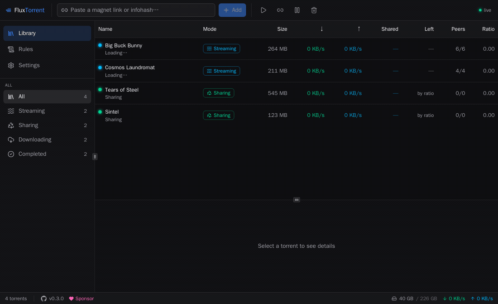
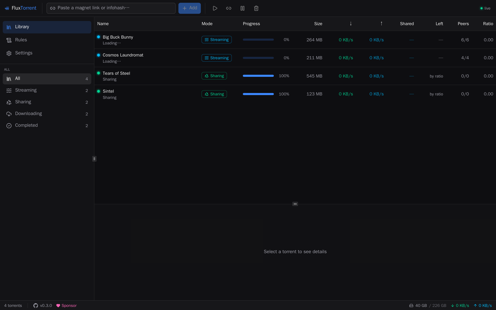
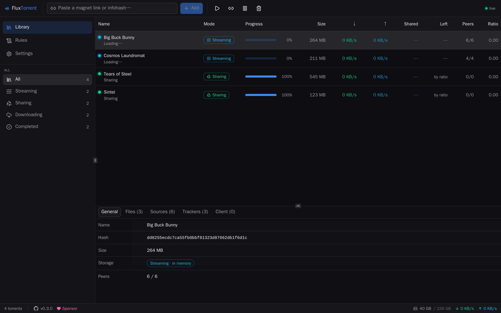
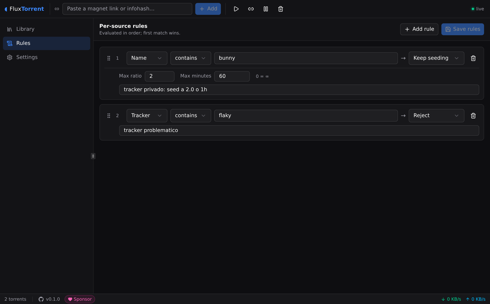
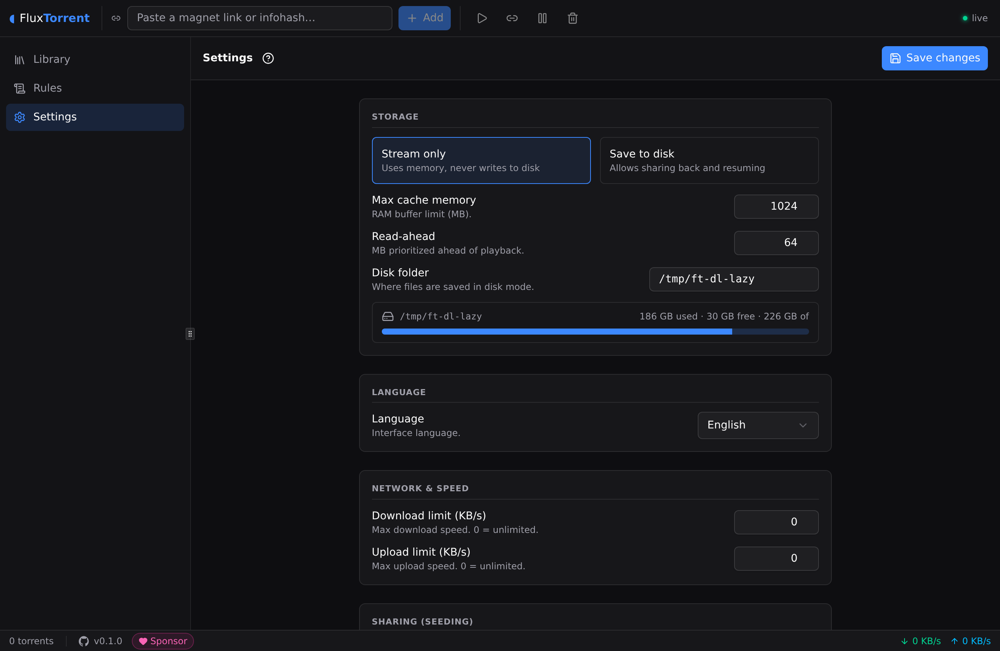
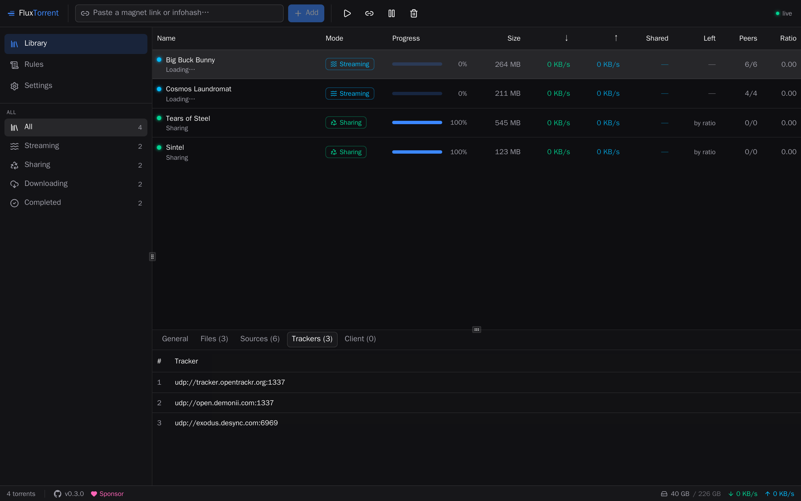
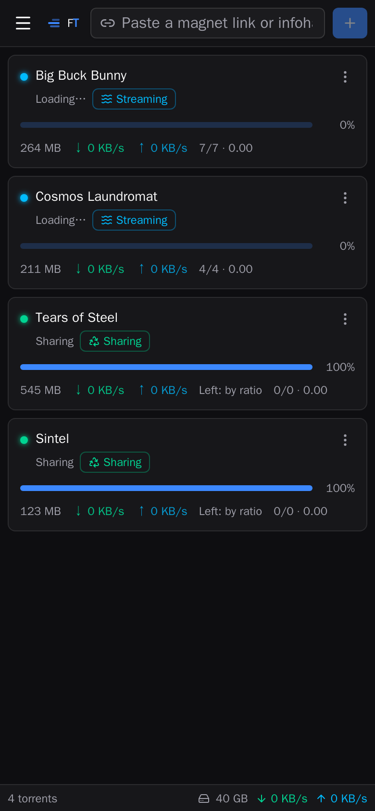

<div align="center">

# ◖ FluxTorrent

**A simple, efficient, self-hosted torrent → HTTP streaming bridge with a web UI.**

Turn a magnet/infohash into a seekable HTTP stream on demand for any media player
(mpv, VLC, Infuse…) — focused, modern, **private-tracker friendly**, and **compatible with the
APIs your clients already speak** (TorrServer, Stremio, torrent2http).

[](LICENSE)
[](https://go.dev)
[](#-quick-start-docker-recommended)
[](https://github.com/sponsors/jodacame)



<sub>Demo library uses Creative-Commons films (Blender open movies).</sub>

</div>

---

## Table of contents

- [What is it?](#what-is-it)
- [Private-first](#-private-first)
- [Features](#features)
- [How it compares](#how-it-compares)
- [Quick start (Docker)](#-quick-start-docker-recommended)
- [Configuration](#configuration)
- [Per-source rules](#per-source-rules)
- [Compatibility](#compatibility)
- [API](#api)
- [Building from source](#building-from-source)
- [Tech stack](#tech-stack)
- [Roadmap](#roadmap)
- [Contributing](#contributing)
- [Security](#security)
- [License](#license)
- [Disclaimer](#disclaimer)
- [Built with AI](#built-with-ai)

---

## What is it?

FluxTorrent does exactly one job and does it well: it turns a **torrent into a seekable
HTTP URL on demand**, with smart piece prioritization so playback starts fast and seeking
doesn't stall. It's a *thin streaming engine*, not a download manager.

You paste a magnet link, FluxTorrent fetches just the pieces your player needs (around the
current playback position), and exposes a standard **HTTP Range** endpoint any video player
understands. Bounded memory, smart seeding, per-source rules, and a clean web UI round it out.

**Design goals:** robust, efficient, single-purpose, simple. Every feature serves streaming
playback, on principles that keep a small always-on box happy: idempotent start (a torrent is
either active or fully gone — never a stuck *"finding peers… 0/0"* zombie), a **bounded RAM
ring buffer** so memory stays predictable, drop-after-playback so torrents don't pile up, and a
no-peers timeout that fails fast instead of hanging.

It stands on the shoulders of the projects that defined this space —
**[TorrServer](https://github.com/YouROK/TorrServer)**, **[Stremio](https://www.stremio.com/)**
and **torrent2http** — and stays **API-compatible** with them so it fits the clients people
already use.

## 🔒 Private-first

Most torrent streamers treat private trackers as an afterthought. FluxTorrent is built to be a
**good citizen on private trackers** out of the box:

- **Auto-detects private torrents** (the BEP27 `private` flag) — no per-tracker setup needed.
- **Smart seeding to satisfy ratio/time** — automatically seeds a private torrent until it
  reaches your target **ratio _or_ seed time** (whichever first), then releases it. This is the
  classic hit-and-run rule, handled for you. Progress is persisted, so seeding survives restarts.
- **Forces disk storage** for private torrents (you can't seed what RAM discards) and downloads
  the full content so there's something to share.
- **No leaks** — private torrents never use DHT/PEX/LSD (enforced by the protocol), and you can
  **force header encryption** to get past torrent-blocking ISPs.
- **Per-source rules** can fine-tune any source further (seed targets, storage mode, connection
  caps), useful when a private tracker has specific requirements.

It's all configurable (or off) in **Settings → Private trackers**.

## Features

- 🎬 **Instant streaming** — magnet/infohash → seekable HTTP (`206 Partial Content`), fast start, smooth seeks.
- 🧠 **Bounded cache** — pure **RAM** (memory-capped ring buffer) or **disk** (configurable path).
- 🔒 **Private-tracker smart seeding** — auto-detect + seed to ratio/time, then drop. Survives restarts.
- 🧭 **Per-source rules** — `reject` / `prefer` / `forceDisk` / `forceRam` / `keepSeed` (+ per-torrent connection cap), first match wins, editable in the UI.
- 📦 **Compressed-release detection** — flags/rejects RAR/ZIP/split archives a player can't use.
- 🔌 **Drop-in compatible** — speaks **TorrServer**, **Stremio** and **torrent2http** APIs, so existing clients just re-point. ([details](docs/COMPATIBILITY.md))
- 🖥️ **Web UI** — sortable torrent table, resizable panels, detail tabs, live WebSocket stats, **dark theme**, **multi-language (es/en, extensible)**.
- 👁️ **Full visibility** — mode (streaming vs sharing), rule target, source (seeders) and **which client is playing** (player + IP), at a glance.
- 🚦 **Speed & network control** — global download/upload caps, connection limit, DHT/IPv6/µTP, header encryption, idle disconnect timeout.
- 🪶 **Single binary, single container** — UI embedded via `go:embed`, ~25 MB image, ultra-light at idle, graceful shutdown.

|  |  |
|---|---|
|  |  |
| **Library** — streaming vs sharing at a glance | **Detail tabs** — files, sources, trackers, players |
|  |  |
| **Per-source rules editor** | **Approachable settings** |
|  |  |
| **Trackers in use** (passkeys redacted) | **Responsive** — works on phones too |

## How it compares

An honest look at where FluxTorrent fits. These are all good tools with different goals —
FluxTorrent is a **focused single-purpose engine**, not a media center.

| | **FluxTorrent** | TorrServer | Stremio (server) | torrent2http / Peerflix |
|---|:---:|:---:|:---:|:---:|
| Primary focus | Torrent→HTTP **streaming engine** | Torrent→HTTP streaming server | Media center + streaming server | Minimal torrent→HTTP CLI |
| Bounded RAM cache | ✅ ring buffer | ✅ | ⚠️ disk/temp | ❌ |
| Disk mode + seeding | ✅ | ✅ | ✅ | partial |
| **Private-tracker smart seeding** (ratio/time, auto) | ✅ | ❌ | ❌ | ❌ |
| **Per-source rules** | ✅ | ❌ | ❌ | ❌ |
| Modern web UI | ✅ | ⚠️ basic | ✅ (full app) | ❌ |
| Speaks **other servers' APIs** | ✅ TorrServer · Stremio · torrent2http | — | — | — |
| See the playing client (player + IP) | ✅ | ❌ | ❌ | ❌ |
| Transcoding | ❌ *(by design)* | ❌ | ✅ | ❌ |
| Catalogs / indexers / addons | ❌ *(by design)* | ❌ | ✅ | ❌ |
| Single binary / small container | ✅ ~25 MB | ✅ | ⚠️ bundled with app | ✅ |
| Ecosystem & maturity | 🆕 new, small | 🏆 large, battle-tested | 🏆 huge | mature but niche |

**Be honest with yourself about what you need:**

- Want a **full media center** with catalogs, addons and transcoding? → **Stremio**.
- Want the **most battle-tested** option with the widest Android/Kodi client support and a big
  community? → **TorrServer**.
- Want a **focused, memory-bounded engine** that's a good citizen on **private trackers**, has
  **per-source rules** and a clean UI, and **drops into clients built for the tools above**?
  → that's where **FluxTorrent** aims to shine. It's newer and its ecosystem is smaller — that's
  the honest trade-off.

## 🚀 Quick start (Docker, recommended)

```bash
docker run -d --name fluxtorrent \
  -p 7001:7001 \
  -p 42069:42069 \
  -v "$PWD/config:/config" \
  -v "$PWD/downloads:/downloads" \
  -e FT_CACHE_MODE=ram \
  --restart unless-stopped \
  ghcr.io/jodacame/fluxtorrent:latest
```

Open **http://localhost:7001**, paste a magnet link, press play. Point any player at
`http://<host>:7001/stream/<hash>/<index>`.

### docker-compose (with persistence)

```yaml
services:
  fluxtorrent:
    image: ghcr.io/jodacame/fluxtorrent:latest   # or build: .
    container_name: fluxtorrent
    ports:
      - "7001:7001"        # API + UI + stream (bound 0.0.0.0)
      - "42069:42069"      # BitTorrent (optional, for incoming peers)
    volumes:
      - ./config:/config         # ← settings, rules, seed/ratio state (bbolt db)
      - ./downloads:/downloads   # ← downloaded files (disk-cache mode only)
    environment:
      - FT_CACHE_MODE=ram        # ram = stream only · disk = save to disk
      - FT_CACHE_SIZE_MB=1024
      - FT_AUTH_PASSWORD=        # set to require a UI login (empty = open)
      - FT_API_TOKEN=            # optional bearer token for machine clients
    restart: unless-stopped
```

```bash
docker compose up -d
```

### Making your data persistent

FluxTorrent keeps **all state in two folders** — mount them as volumes and your setup
survives restarts, upgrades and re-creates:

| Volume | Holds | Needed when |
|---|---|---|
| `/config` | bbolt DB: **settings, rules, seed/ratio state, torrent list** | always (recommended) |
| `/downloads` | the actual media files | only in **disk** cache mode |

In **RAM mode** nothing is written to `/downloads` (pure streaming). In **disk mode** files
persist there, which is what enables seeding and resume. Your `keepSeed` ratio/time progress
lives in `/config`, so private-tracker seeding continues across restarts.

> **Migrating from another server?** Run FluxTorrent on the same port your client used
> (`-e FT_LISTEN_PORT=8090 -p 8090:8090`) and existing TorrServer/Stremio clients keep working
> unchanged — saved stream URLs resolve as-is. See [docs/COMPATIBILITY.md](docs/COMPATIBILITY.md).

## Configuration

Everything is editable in the **Settings** screen (with a built-in help guide) and persisted to
`/config`. It can also be booted from environment variables:

| Env var | Default | Description |
|---|---|---|
| `FT_LISTEN_HOST` | `0.0.0.0` | Bind address |
| `FT_LISTEN_PORT` | `7001` | API + UI + stream port |
| `FT_BT_PORT` | `42069` | Incoming BitTorrent port |
| `FT_CACHE_MODE` | `ram` | `ram` (stream only) or `disk` (save + seed) |
| `FT_CACHE_SIZE_MB` | `1024` | RAM ring-buffer cap |
| `FT_CACHE_PATH` | `/downloads` | Disk-mode storage root |
| `FT_READAHEAD_MB` | `64` | Bytes prioritized ahead of playback |
| `FT_API_TOKEN` | _(empty)_ | Optional `Authorization: Bearer <token>` for `/api/*` (machine clients) |
| `FT_AUTH_PASSWORD` | _(empty)_ | Set to require a **password login** on the UI + `/api/*`. Empty = no login |
| `FT_AUTH_SESSION_HOURS` | `168` | How long a UI login stays valid (session cookie lifetime) |
| `FT_CONFIG_DIR` | `/config` | Where the bbolt DB lives |

From the UI you can also tune: download/upload speed limits, max active torrents, no-peers
timeout, seeding defaults, the disk folder, and an **Advanced** section — DHT, connection
limit, **force header encryption**, IPv6, µTP, and an idle **disconnect timeout**.

### Authentication (`FT_AUTH_PASSWORD`)

By default FluxTorrent is **open** — anyone who can reach the port uses it. Set
**`FT_AUTH_PASSWORD`** to require a single password to open the UI:

```yaml
environment:
  - FT_AUTH_PASSWORD=choose-a-strong-password
  # - FT_AUTH_SESSION_HOURS=168   # optional: how long a login lasts (default 7 days)
```

- **Empty (default) → no login**, everything stays open (unchanged behavior).
- **Set → a login screen gates the UI.** A successful login issues an **HttpOnly,
  SameSite** session cookie (marked **`Secure`** automatically when served over HTTPS),
  valid for `FT_AUTH_SESSION_HOURS` (default **168 h / 7 days**). There is **no password
  recovery** — it's the value of the env var; change the variable and restart to rotate it.
- Login attempts are **rate-limited per IP** (5 failures → a short lockout) and the
  password is compared in constant time.
- **What stays open for players** (they can't log in interactively): `/stream`, `/echo`,
  and the compat actions a player needs to play — `add` / `get` / `drop` on `/torrents`.
  The **mutating** compat actions (`rem`, `set`, and `set` on `/settings`) are gated too.
- **`FT_API_TOKEN`** is independent and for **machine clients**: send
  `Authorization: Bearer <token>` to reach `/api/*` and the gated actions without a browser
  session. Either a valid session **or** the bearer token is accepted.

> Going public? Always put it behind **TLS** (a reverse proxy) so the session cookie is
> `Secure`, and prefer a **VPN** when you can. See [Security](#security).

### Disk cleanup (disk mode)

In **RAM mode** nothing is written to disk, so there's nothing to clean. In **disk mode**
FluxTorrent frees space automatically so `/downloads` never fills up. Tune it in the
**Settings → Disk cleanup** screen:

| Setting | Default | What it does |
|---|---|---|
| **Disk limit (GB)** | `0` = off | Hard cap for the download folder. When exceeded, the **oldest unused** content is deleted first until back under the cap. |
| **Safety window (min)** | `60` | After content is no longer needed it's kept this long before deletion, so replaying it **resumes without re-downloading**. |
| **Delete after sharing** | `on` | Free the files once a torrent meets its seed **ratio/time** target. |
| **Delete after watching** | `on` | Remove leftover files after you finish watching or a torrent goes idle. |

**What is kept:** anything **being watched right now** or **still seeding toward a live
target** is never touched. **Private torrents** manage their own ratio/time window, so they're
deleted **immediately** when it's met (no safety window). Everything else is retired: dropped
from the active set, kept for the safety window (so a returning viewer resumes instantly), then
deleted. The disk cap is a hard guarantee — under pressure it evicts the oldest content first,
overriding the safety window.

### Per-source rules

Rules are evaluated **in order, first match wins** (edit them in the **Rules** screen):

- **`keepSeed`** — download fully, save to disk, and seed until `maxRatio` **or** `maxMinutes`
  is reached (whichever first; `0` = ∞), then drop. Ideal for private trackers.
- **`forceDisk` / `forceRam`** — override the storage mode for matching torrents.
- **`reject`** — refuse a flaky source (with a reason returned to the client).
- **`prefer`** — bias peer selection / keep-alive priority.
- Any rule can also set a **per-torrent connection cap** (override), handy for private trackers.

Anything that matches no rule simply **streams in RAM** and is dropped after playback.

## Compatibility

The torrent-streaming space has excellent prior art, and rather than reinvent client protocols
FluxTorrent **implements the APIs those projects established** — so the players and front-ends
already built for them work here unchanged:

| Server | Transparency | Notes |
|---|---|---|
| **TorrServer** (MatriX) | Full | `/echo`, `/torrents`, `/stream`, `/play`, `/settings` |
| **Stremio** (streaming server) | Full | root-level `/{infoHash}/{fileIdx}`, `/create`, `/stats.json` |
| **torrent2http** (Kodi/Quasar) | Best-effort | single-torrent API; targets `?hash=` or the latest torrent |

Full endpoint mapping and the list of clients that work unchanged:
**[docs/COMPATIBILITY.md](docs/COMPATIBILITY.md)**.

## API

Base: `http://<host>:7001`. Native, documented surface (prefer this for new integrations):

```
POST   /api/torrents        { "link": "magnet:…" | "infohash" }
GET    /api/torrents        → list with live stats
GET    /api/torrents/:hash  → one torrent (stats, files, clients)
POST   /api/torrents/:hash/drop
DELETE /api/torrents/:hash  (?withFiles=true)
GET    /stream/:hash/:index → Range-capable video bytes  ← players
GET/PUT /api/settings
GET/PUT /api/rules
WS     /api/events          → live { type:"stats", torrents:[…] }
GET    /api/health
```

The stream URL is **stable and token-free** so saved player URLs survive restarts.

## Building from source

Requires Go 1.23+ and Node 18+.

```bash
# 1. build the embedded UI
cd web && npm install && npm run build && cd ..

# 2. build the single binary (UI baked in)
go build -o fluxtorrent ./cmd/fluxtorrent

# 3. run
FT_CONFIG_DIR=./config ./fluxtorrent      # → http://localhost:7001
```

Or just `docker build -t fluxtorrent .` (multi-stage: Node builds the UI → Go embeds it →
tiny Alpine runtime).

## Tech stack

Go + [anacrolix/torrent](https://github.com/anacrolix/torrent) engine · React + Vite +
TypeScript + [shadcn/ui](https://ui.shadcn.com) UI embedded via `go:embed` · bbolt
persistence · Docker.

## Roadmap

- [x] Core engine: add / stream / drop / delete / stats, idempotent start, no zombie state
- [x] RAM ring buffer + disk mode, compressed detection, no-peers timeout
- [x] Per-source rules + `keepSeed` ratio/time enforcement
- [x] Private-tracker auto-detection & smart seeding
- [x] Web UI (sortable table, resizable panels, rules editor, settings, i18n es/en)
- [x] TorrServer / Stremio / torrent2http compatibility · speed/network controls
- [ ] More languages · per-torrent storage override in the UI · metrics endpoint

## Contributing

Contributions, issues and translations are welcome! New languages are a single file under
`web/src/i18n/locales/`. Open an issue to discuss larger changes first.

If FluxTorrent is useful to you, consider **[sponsoring](https://github.com/sponsors/jodacame)** ❤ — it helps keep the project maintained.

## Security

FluxTorrent is a **self-hosted service meant for a trusted network**. By default it
has **no authentication**, permissive CORS, and binds `0.0.0.0` — anyone who can
reach the port can control it.

- Set **`FT_AUTH_PASSWORD`** to require a **password login** on the UI. It issues an
  HttpOnly, SameSite session cookie (default 7 days) and gates the UI + `/api/*`.
  Login attempts are rate-limited per IP. Leave it empty to keep the UI open.
- Set **`FT_API_TOKEN`** to also accept an `Authorization: Bearer <token>` on `/api/*`
  for machine clients (scripts, integrations). Either a valid session or the bearer
  token is accepted.
- Both guard the **UI, all `/api/*`, and the mutating player-compat actions**
  (`rem`/`set` on `/torrents`, `set` on `/settings`). What a player actually needs to
  play — `add`/`get`/`drop`, `/stream`, `/echo` — **stays open by design** so external
  players (Kodi/Stremio/VLC) work without credentials. Stream URLs require the torrent
  infohash, which is effectively unguessable.
- To expose it publicly, **always add TLS** (a reverse proxy) and prefer keeping it
  behind a **VPN** when you can.

Full details and how to report vulnerabilities: **[SECURITY.md](SECURITY.md)**.

## License

[Apache-2.0](LICENSE). You're free to use, modify and redistribute it under those
terms; it comes with no warranty (see [Disclaimer](#disclaimer)).

## Disclaimer

FluxTorrent is a **general-purpose streaming engine** — software that turns BitTorrent data
into an HTTP stream. It ships with **no content, no trackers, no indexers and no preconfigured
sources**, and it does not endorse or facilitate any particular use.

The software is provided **"as is", without warranty of any kind**, express or implied (see the
[LICENSE](LICENSE) for the full terms). To the maximum extent permitted by law, the authors and
contributors **accept no liability** for any claim, damages or other liability arising from the
use of this software.

**You are solely responsible** for what you add, stream, download and share with it, and for
ensuring your use complies with all applicable laws, regulations, and the rules of any tracker
or network you connect to. Downloading or sharing copyrighted material without authorization may
be illegal in your jurisdiction. Use FluxTorrent only with content you have the right to access
and distribute. By using the software you accept full responsibility for your usage.

## Built with AI

FluxTorrent was built **100% with AI, under human supervision** — an experiment in modern,
AI-native software development.

A human set the direction, made the product and architecture decisions, reviewed every change
and validated the result; an AI agent did the implementation — engine, compatibility layers,
UI, tests, Docker and CI — iterating from a written specification and continuous feedback. Each
feature was verified end-to-end (real torrents, real streaming, live screenshots) before being
accepted.

This is a deliberate showcase of where software development is heading: humans steering intent,
taste and judgment; AI handling the implementation at speed. The code is meant to be read,
audited and improved like any other — the workflow that produced it just happens to be new.

